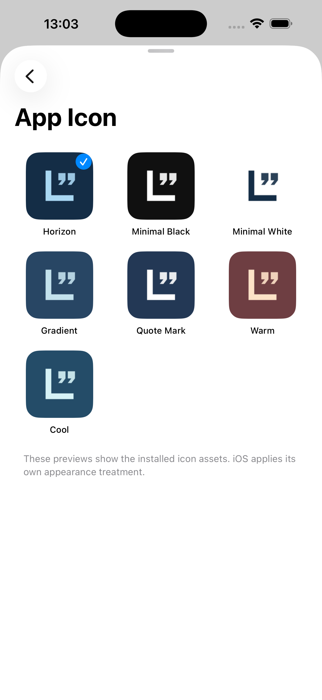

# 🌟 LERN — Daily Quotes & Wisdom

<p align="center">
  <b>Ваш личный оазис мудрости, вдохновения и осознанности на каждый день.</b><br>
  Нативное, невероятно быстрое и эстетичное приложение для <b>iPhone</b>, <b>iPad</b> и <b>Apple Watch</b> в дизайне <b>iOS 18 Liquid Glass</b>.
</p>

<p align="center">
  <a href="https://github.com/memodlike/LERN/releases"></a>
  <a href="https://github.com/memodlike/LERN/actions/workflows/qa.yml"></a>
  
  
  
  
</p>

---

## 📱 Скриншоты приложения

<p align="center">
  
  &nbsp;
  
  &nbsp;
  
  &nbsp;
  
</p>

---

## 💡 Что такое LERN? (Объясняем простыми словами)

Представьте, что все ваши любимые цитаты из книг, мудрые мысли великих людей, заметки из путешествий и важные напоминания собраны в одном красивом, тихом и спокойном месте — прямо у вас в кармане. 

**LERN** — это не очередная «соцсеть» с навязчивыми уведомлениями и алгоритмами. Это ваш персональный компаньон:
- 🚫 **Никакой рекламы и подписок**: всё доступно сразу и навсегда.
- 🔒 **Абсолютная приватность**: ни одного байта ваших данных не отправляется в интернет. Никаких серверов, трекеров или слежки. Всё хранится только на вашем устройстве.
- ✈️ **Работает 100% офлайн**: читайте и вдохновляйтесь в самолёте, метро или на природе.
- 🎨 **Эталонный нативный дизайн**: создано с любовью по стандартам Apple Human Interface Guidelines с эффектом матового стекла (Liquid Glass), плавной анимацией и приятным виброоткликом (Haptics).

---

## ✨ Главные суперсилы LERN

### 📖 1. Умная и эстетичная лента мыслей
- **Чтение без стресса**: листайте цитаты жестом смахивания. Доступны режимы: *по порядку*, *абсолютно случайно* или *умное перемешивание без повторений*.
- **Поиск за доли секунды**: мгновенно находите нужные высказывания по авторам, ключевым словам или тегам.
- **Свои коллекции и авторы**: создавайте собственные подборки («Стоицизм», «Мотивация», «Любимые стихи», «Бизнес и фокус»).

### 🎨 2. Студия персонализации: 24 дизайнерские иконки
- **24 авторские иконки на выбор**: выберите идеальный стиль для главного экрана вашего iPhone — от строгих *Obsidian Gold*, *Titanium*, *Deep Space* и *Graphite Slate* до ярких *Midnight Aurora*, *Solar Flare*, *Matcha Zen* и *Cosmic Orbit*.
- **Темы оформления**: темные и светлые темы, кастомные фоны, фирменные шрифты Apple (Serif, Sans, Rounded, Monospace) и эффекты полупрозрачного стекла.

### ⏰ 3. Бережные напоминания с приятными звуками
- Получайте ненавязчивые порции мудрости в течение дня — утром во время кофе, в обеденный перерыв или вечером перед сном.
- **3 кристально чистых авторских звука (chimes)**, которые звучат мягко и гармонично.
- 👁️ **Приватный режим**: цитата может быть скрыта на заблокированном экране, если вы не хотите, чтобы окружающие видели ваши личные мысли. Достаточно коснуться уведомления, чтобы открыть её внутри.

### 📲 4. Виджеты для экрана блокировки и Apple Watch
- **Виджеты всех размеров**: маленькие, средние и большие виджеты для главного экрана, а также минималистичные виджеты для экрана блокировки (Always-On Display).
- **Интерактивность**: ставьте цитате лайк (в избранное) прямо из виджета, не заходя в приложение!
- **Apple Watch**: полноценное приложение для часов и стильные осложнения циферблата (Complications & Smart Stack).

### 📥 5. Импорт любых библиотек в один клик
- Легко перенесите цитаты из заметок, Telegram или текстовых файлов.
- Поддерживаются любые форматы: **TXT**, **Markdown (.md)**, **CSV**, **TSV**, **JSON** и **JSONL**.
- **Встроенный AI-помощник** прямо в приложении подскажет правильную структуру файла и поможет автоматически отформатировать текст.
- Лимиты: до 100 000 записей в одной библиотеке, мгновенная потоковая обработка.

### 🖼️ 6. Генератор открыток для Instagram и Telegram
- Превращайте понравившиеся мысли в эстетичные изображения для Stories, постов или обоев смартфона (форматы 9:16, 4:5, 1:1).
- Интеграция с системными **Apple Shortcuts (Быстрыми командами)**: настраивайте автоматическую смену обоев на iPhone со свежей мыслью каждого утра (`Get Wallpaper` → `Set Wallpaper Photo`).

---

## 🚀 Как начать пользоваться? (Всего 3 шага)

### Вариант 1: Быстрый запуск готовой версии
1. Перейдите в раздел **[Releases](https://github.com/memodlike/LERN/releases)** и скачайте последнюю версию.
2. Откройте приложение на вашем iPhone или запустите в симуляторе.
3. Настройте любимую тему, выберите иконку в **Профиле** и наслаждайтесь чтением!

### Вариант 2: Для владельцев Xcode и разработчиков
Если вы хотите собрать приложение самостоятельно из исходного кода:

```bash
# 1. Клонируйте репозиторий
git clone https://github.com/memodlike/LERN.git
cd "LERN - Daily quotes"

# 2. Откройте готовый проект в Xcode
open LERN.xcodeproj

# Либо запустите сборку в симуляторе одной командой:
./scripts/run-simulator.sh
```

---

## 🛠️ Для разработчиков и инженеров

Проект LERN построен на передовом нативном стеке Apple без сторонних тяжелых зависимостей:

- **Язык**: Swift 6 (Strict Concurrency, Modern Swift Concurrency)
- **UI**: SwiftUI (iOS 18+, watchOS 11+, NavigationStack, Dynamic Type AX1–AX5, VoiceOver, Reduce Motion)
- **База данных**: SwiftData (`ModelActor`, фоновая потоковая обработка, транзакционная атомарность, поддержка App Groups `group.com.memodlike.lern`)
- **Синхронизация**: WatchConnectivity (пакеты до 59 КБ, двусторонний протокол очередей)
- **Виджеты**: WidgetKit + App Intents (интерактивные кнопки лайка и перехода)
- **Фоновые задачи**: BackgroundTasks Framework (`BGAppRefreshTask`)

### Тестирование и проверка качества

```bash
# Запуск модульных тестов и бенчмарков (80+ тестов):
swift test

# Запуск тестов под экстремальной нагрузкой (100 000 записей):
LERN_LARGE_TEST=1 swift test

# Сборка проекта в Xcode через CLI:
xcodebuild -project LERN.xcodeproj -scheme LERN \
  -destination 'generic/platform=iOS Simulator' \
  -derivedDataPath DerivedData CODE_SIGNING_ALLOWED=NO build

# Проверка полноты и целостности локализации (RU / EN):
python3 scripts/validate-localizations.py
```

Подробные инженерные отчеты, спецификации и архитектура:
- 📖 [Руководство по QA и лимитам](docs/QA.md)
- 🔒 [Отчет по безопасности и приватности](docs/security/README.md)
- 🎨 [Дизайн-система и принципы HIG](docs/DESIGN.md)
- 📚 [Спецификация форматов источников данных](docs/SOURCES.md)

---

## 📄 Лицензия

Проект распространяется под свободной лицензией **MIT**. Вы можете свободно использовать, модифицировать и развивать его.

<p align="center">
  Сделано с уважением к вашей приватности и вниманию. 🕊️
</p>
