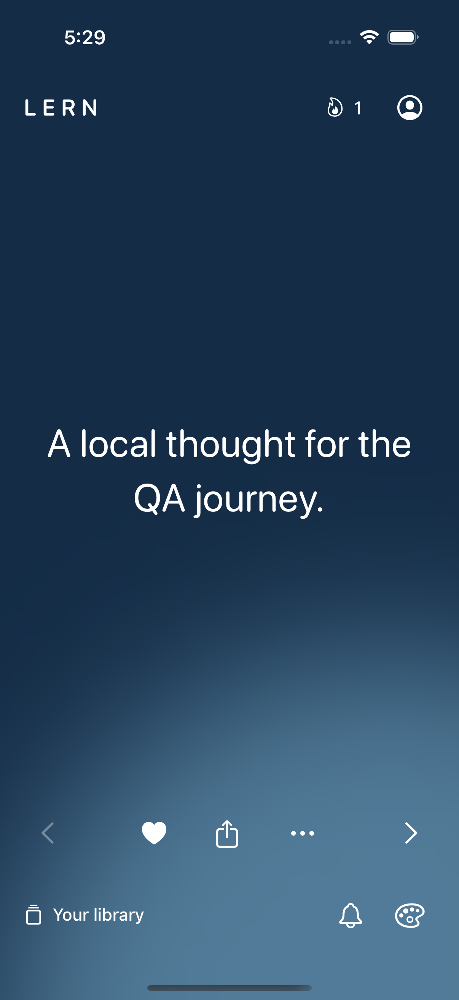
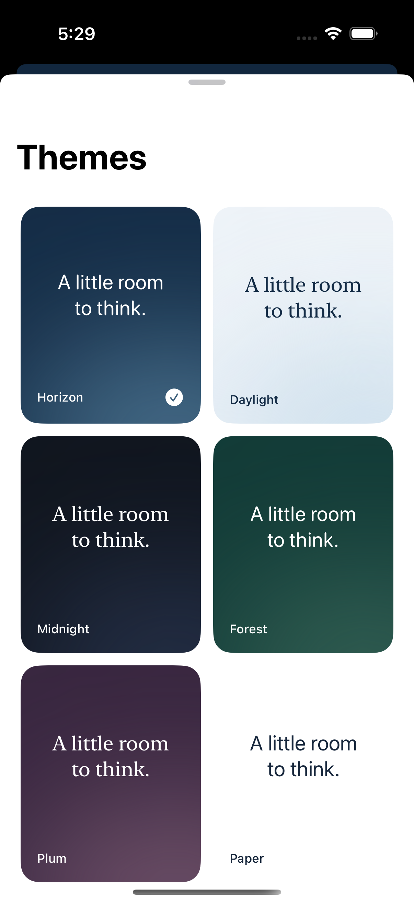
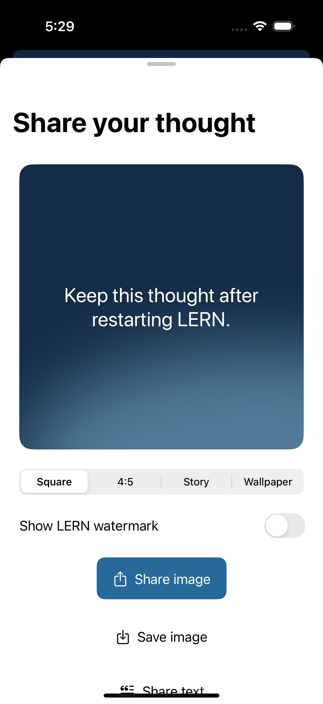

# LERN — Daily quotes

Нативная личная библиотека для iPhone и iPad: ваши записи, темы, напоминания и виджеты. SwiftUI, SwiftData, WidgetKit, App Intents и WatchConnectivity. iOS 18+, watchOS 11+. Без аккаунта, рекламы, платных функций, аналитики и серверной части.

[Скачать сборку](https://github.com/memodlike/LERN/releases) · [Проверки](https://github.com/memodlike/LERN/actions/workflows/qa.yml) · [QA и ограничения](docs/QA.md) · [Безопасность](docs/security/README.md) · [Источники](docs/SOURCES.md)

<p>
  
  
  
</p>

## Возможности

- Импорт через «Файлы»: MD, TXT, CSV, TSV, JSON и JSONL. Несколько файлов, локальный предпросмотр, SHA-256 идентичность записи, добавление, замена, отмена и стабильные дочерние разделы Markdown.
- Лента с последовательным чтением, перемешиванием без повторов в цикле и случайным выбором. Поиск, свои записи, избранное, скрытие записей и фраз, коллекции, история.
- Независимые источники для ленты, каждой группы напоминаний, вариантов виджетов, экрана блокировки, Apple Watch и обоев.
- До 60 локальных уведомлений суммарно: детерминированная справедливая очередь не даёт одной частой группе вытеснить остальные. Время, несколько времён, интервал, дни недели, три оригинальных звука и приватный режим без текста на экране блокировки. Очередь пополняется при событиях приложения и best-effort BGAppRefresh.
- Шесть оформлений, собственные цвета и фотографии, шрифты и Theme Mix. Семь вариантов значка приложения.
- Экспорт изображения: квадрат, 4:5, 9:16 и обои; системная отправка полного текста; сохранение в «Фото». Водяной знак выключен по умолчанию.
- Виджеты трёх размеров, экран блокировки, серия чтения и случайная мысль. Интерактивное избранное и переход к отправке.
- Приложение для Apple Watch, complication и Smart Stack. Локальная передача выбранных записей с iPhone.
- Полная локальная резервная копия, включая фото, настройки и коллекции. Книги/материалы с обложками и импортом JSON/CSV.
- Английский и русский интерфейс, Dynamic Type, VoiceOver, Reduce Motion.

## Открыть проект

Откройте `LERN.xcodeproj`, выберите схему **LERN** и установленный iPhone Simulator. Репозиторий содержит сгенерированный проект; XcodeGen для обычного запуска не требуется. Если меняете `project.yml`, выполните `xcodegen generate`.

Полный Xcode обязателен: Command Line Tools не содержат плагин макросов SwiftData. После первого запуска Xcode завершите системную установку компонентов и принятие лицензии с учётной записью администратора. Установите iOS и watchOS Simulator той версии, которую предлагает выбранный Xcode.

Готовая сборка в Releases предназначена для iOS Simulator на Mac с Apple Silicon. Распакуйте `LERN-Simulator.zip` и запустите её через приведённый ниже скрипт. Это не установочный файл для физического iPhone; для него нужна сборка с вашей подписью в Xcode.

Для физического устройства выберите свою Team в Signing & Capabilities у **LERN**, **LERNWidgets**, **LERNWatch** и **LERNWatchWidgets**. При необходимости зарегистрируйте общий App Group `group.com.memodlike.lern` либо измените его согласованно в `Product.appGroup` и entitlement-файлах. Учётные данные Apple Developer в репозитории отсутствуют.

## Воспроизводимые проверки

```sh
swift test
LERN_LARGE_TEST=1 swift test
xcodebuild -project LERN.xcodeproj -scheme LERN \
  -destination 'generic/platform=iOS Simulator' \
  -derivedDataPath DerivedData CODE_SIGNING_ALLOWED=NO build
xcodebuild -project LERN.xcodeproj -scheme LERN \
  -destination 'platform=iOS Simulator,name=<installed iPhone>' \
  -derivedDataPath DerivedData CODE_SIGNING_ALLOWED=NO test
```

Не передавайте глобальный `-sdk iphonesimulator`: схема содержит Watch, которому нужен собственный watchOS SDK. CI выбирает совместимый Xcode и конкретный установленный симулятор автоматически. Артефакт `ios-qa` содержит сборку для симулятора, логи, `.xcresult` и снимки экранов. Это не подписанный IPA для iPhone.

После завершения первоначальной настройки Xcode можно запустить `scripts/run-simulator.sh`: он соберёт и откроет LERN в установленном симуляторе. Для готового распакованного приложения передайте путь: `scripts/run-simulator.sh /path/to/LERN.app`.

## Форматы и пределы

CSV: `text` / `quote` / `body` / `content`, необязательные `author`, `source`, `tags`, `section` или `category`; запятая, точка с запятой и tab определяются автоматически и могут быть выбраны вручную. TXT: строки либо абзацы, и выбранная раскладка видна в предпросмотре. Markdown: абзацы, списки, цитаты, заголовки `#`–`######` с пробелом и необязательные `author`, `source`, `tags` во front matter; fenced code не создаёт разделов. JSON: массив строк либо объектов с теми же полями; JSONL: объект или строка на каждой строке. Примеры находятся в `Fixtures`.

Один импорт: до 100 MiB, 100 000 записей, 20 000 символов на запись; метаданные до 2 000 символов, до 64 тегов по 256 символов. Структура JSON и суммарный объём унаследованных метаданных проверяются до создания записей. Интерфейс читает страницы по 50 записей. Коллекция показывает первые 200 совпадений с поиском; чтение доступно для всей коллекции.

Импортированные библиотеки можно переименовать, приостановить, возобновить, просмотреть и удалить из меню библиотеки. Пауза исключает библиотеку из выбранного источника, не расширяя его до всех записей. Удаление удаляет только её связи и дочерние разделы: общие записи сохраняются, а избранные записи без других связей переходят в «My Content». Замена меняет связи выбранной библиотеки; сами записи, их избранное и связи с другими коллекциями сохраняются. Отмена откатывает текущий файл; уже завершённые файлы остаются в библиотеке. Предпросмотр показывает повторы внутри файла, число разделов, ограничение текста уведомлений и первые структурированные предупреждения.

Книги CSV: `title,author,note,url`. JSON: массив объектов с этими строковыми полями. Лимит 10 MB и 10 000 материалов. CSV-заметки ограничены 2 000 символов, JSON и ручные заметки — 20 000.

## Поведение платформы

Уведомление «запланировано» означает принятие запроса iOS, а не доказанный показ. LERN показывает фактические параметры iOS для alerts, sound, Notification Center, lock screen и Scheduled Summary; Focus, беззвучный режим и Scheduled Summary всё равно могут изменить показ. Очередь рассчитана по её фактической дате покрытия, а не только по счётчику из 60 запросов. Откройте LERN периодически: BGAppRefresh — best-effort и не имеет гарантированного времени запуска. «Утреннее напоминание» остаётся обычным локальным уведомлением, не является Critical Alert и не использует Time Sensitive.

Отключите «Show thought text in notifications» в профиле, если текст записи не должен появляться в предварительном просмотре. В этом режиме LERN оставляет только общий текст и сохраняет идентификатор записи, поэтому касание всё равно открывает исходную мысль.

iOS определяет время обновления виджетов. Обои меняет пользовательская автоматизация в «Командах»: LERN **Get Wallpaper** → **Set Wallpaper Photo**. Приложение само не изменяет системные обои.

Watch получает до 100 записей в пакете менее 59 KB; длинные записи передаются как отрывки. Полная библиотека остаётся на iPhone. Изображения содержат до 600 символов длинной записи с многоточием; полная запись доступна в ленте и при отправке текста.
